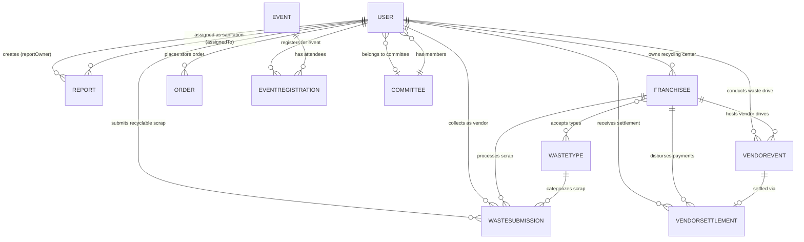

# 🗄️ Urban Pulse - Database Schema Specification

> **Platform:** Urban Pulse — AI-Powered Smart Waste Management & Civic Cleanliness Platform  
> **Database Engine:** MongoDB Atlas (NoSQL) via Mongoose ODM  
> **Geospatial Engine:** GeoJSON (`Point`, 2dsphere indexing)  
> **Target Version:** 1.0.0

---

## 1. Architecture Overview

Urban Pulse utilizes a flexible, high-performance document database structure tailored for:
1. **Real-time Geo-spatial Analytics**: Fast radius queries (`$near`, `$geoWithin`) using MongoDB 2dsphere indexes for sanitation dispatch, nearest recycling franchisee locator, and vendor event detection.
2. **Dual-Source Cleanliness Operations**: Handling both AI-driven CCTV litter detection (YOLOv8 bounding boxes) and crowdsourced citizen photo uploads with GPS coordinates.
3. **Circular Economy & Recycling Logistics**: End-to-end workflow tracing citizen scrap submissions, franchisee collection quotas, vendor pickup drives, and settlements.
4. **Gamification & Civic Engagement**: Dual-currency reward system (`points` for civic leaderboards and `greencoins` redeemable for eco-friendly products in the Green Store).

```
 ┌────────────────────────────────────────────────────────────────────────┐
 │                              MongoDB                                   │
 │                                                                        │
 │   ┌──────────────┐         ┌───────────────┐        ┌──────────────┐   │
 │   │    Users     │◄───────┤    Reports    │        │  Committees  │   │
 │   └──────┬───────┘         └───────────────┘        └──────┬───────┘   │
 │          │                        ▲                        │           │
 │          │ (Citizen/Vendor/OSP)   │ (Civic Action)         │ (RWA)     │
 │          ▼                        │                        ▼           │
 │   ┌──────────────┐         ┌───────────────┐        ┌──────────────┐   │
 │   │ WasteSubmiss.│◄───────┤  Franchisees  │        │    Events    │   │
 │   └──────┬───────┘         └───────┬───────┘        └──────┬───────┘   │
 │          │                         │                       │           │
 │          ▼                         ▼                       ▼           │
 │   ┌──────────────┐         ┌───────────────┐        ┌──────────────┐   │
 │   │  WasteTypes  │         │ VendorSettlem.│        │ EventRegistr.│   │
 │   └──────────────┘         └───────────────┘        └──────────────┘   │
 └────────────────────────────────────────────────────────────────────────┘
```

---

## 2. Entity-Relationship (ER) Diagram



---

## 3. Collections & Schema Specifications

### 3.1. `users` Collection
**Model:** `User` (`backend/schemas/User.js`)  
**Description:** Central user entity supporting authentication, Role-Based Access Control (RBAC), OTP verification, gamification points, GreenCoins wallet, and an embedded shopping cart.

| Field | Type | Required | Default | Constraints / Enum | Description |
| :--- | :--- | :--- | :--- | :--- | :--- |
| `_id` | `ObjectId` | Auto | Generated | Primary Key | Unique document identifier |
| `googleId` | `String` | No | `null` | `unique`, `sparse` | Google OAuth2 identifier |
| `fname` | `String` | No | `null` | Trimmed | First name |
| `lname` | `String` | No | `null` | Trimmed | Last name |
| `email` | `String` | **Yes** | — | `unique`, `lowercase`, trimmed | User login email |
| `phone` | `String` | **Yes** | — | `unique`, Regex: `/^[6-9]\d{9}$/` | Valid 10-digit Indian phone number |
| `aadhar` | `String` | **Yes** | — | `unique`, length: 12 | 12-digit Indian national identity number |
| `role` | `String` | **Yes** | `"user"` | `user`, `admin`, `official`, `osp`, `vendor` | Access control role |
| `dob` | `Date` | No | `null` | — | Date of birth |
| `gender` | `String` | No | `null` | `Male`, `Female`, `Other` | Gender |
| `address` | `String` | No | `null` | Trimmed | Residential address |
| `profileImg`| `String` | No | `null` | URL string | Cloudinary avatar URL |
| `points` | `Number` | No | `0` | Min: 0 | Civic activity reputation points |
| `greencoins` | `Number`| **Yes** | `0` | Min: 0 | Spendable digital token currency |
| `reports` | `[ObjectId]` | No | `[]` | `ref: "Report"` | Array of reports submitted by user |
| `committee` | `ObjectId` | No | `null` | `ref: "Committee"` | Affiliated residential committee |
| `isOnDuty` | `Boolean` | No | `false` | — | Active shift toggle (for OSP staff) |
| `otp` | `String` | No | `null` | — | 6-digit verification code |
| `otpExpires`| `Date` | No | `null` | — | Timestamp when OTP becomes invalid |
| `isOtpVerified` | `Boolean` | No | `false` | — | Verification flag |
| `cart` | `[CartItem]`| No | `[]` | Embedded subdocument | Green Store user cart items |
| `createdAt` | `Date` | Auto | Date.now | — | Mongoose timestamp |
| `updatedAt` | `Date` | Auto | Date.now | — | Mongoose timestamp |

#### Embedded Subdocument: `CartItem` (`cartItemSchema`)
| Field | Type | Required | Description |
| :--- | :--- | :--- | :--- |
| `id` | `Number` | **Yes** | Catalog product ID |
| `name` | `String` | **Yes** | Product name |
| `price` | `Number` | **Yes** | Unit price in GreenCoins / INR |
| `description` | `String` | No | Short product description |
| `img` | `String` | No | Product image thumbnail URL |
| `category` | `String` | **Yes** | Product classification |
| `quantity` | `Number` | **Yes** | Item count in cart (Min: 1) |

---

### 3.2. `reports` Collection
**Model:** `Report` (`backend/schemas/Report.js`)  
**Description:** Geo-tagged civic complaints and automated AI camera detections for garbage, overflowing bins, and littered zones.

| Field | Type | Required | Default | Constraints / Enum | Description |
| :--- | :--- | :--- | :--- | :--- | :--- |
| `_id` | `ObjectId` | Auto | Generated | Primary Key | Unique report identifier |
| `reportImg` | `String` | **Yes** | — | URL string | Raw uploaded photo (Cloudinary) |
| `reportYoloImg`| `String` | No | `null` | URL string | Annotated image with YOLO bounding boxes |
| `location` | `GeoJSON Point` | **Yes** | — | `{ type: "Point", coordinates: [lng, lat] }` | 2dsphere indexed coordinates |
| `remarks` | `String` | No | `"NA"` | — | Citizen notes or description |
| `time` | `Date` | No | Date.now | — | Incident report time |
| `status` | `String` | **Yes** | `"pending"` | `pending`, `allotted`, `resolved` | Resolution workflow status |
| `reportOwner`| `ObjectId` | **Yes** | — | `ref: "User"` | Citizen who raised the report |
| `assignedTo` | `ObjectId` | No | `null` | `ref: "User"` | Sanitation worker / OSP on duty |
| `createdAt` | `Date` | Auto | Date.now | — | Mongoose timestamp |
| `updatedAt` | `Date` | Auto | Date.now | — | Mongoose timestamp |

**Indexes:**
- `location: "2dsphere"` — Enables `$near` proximity queries for nearby sanitation van dispatch.

---

### 3.3. `committees` Collection
**Model:** `Committee` (`backend/schemas/Committee.js`)  
**Description:** Resident Welfare Associations (RWA), neighborhood societies, or village councils participating in community-level cleanliness drives.

| Field | Type | Required | Default | Constraints / Enum | Description |
| :--- | :--- | :--- | :--- | :--- | :--- |
| `_id` | `ObjectId` | Auto | Generated | Primary Key | Unique committee identifier |
| `committeeName`| `String` | **Yes** | — | `unique`, trimmed | Name of society/colony |
| `description` | `String` | No | `null` | Trimmed | Committee charter or description |
| `localityType` | `String` | No | `"Society"` | `Society`, `Colony`, `Village`, `Apartment`, `Commercial Area`, `Other` | Type of neighborhood |
| `approxHouseholds`| `Number` | No | `0` | Min: 0 | Number of homes represented |
| `leaderName` | `String` | **Yes** | — | Trimmed | Green Leader full name |
| `leaderEmail`| `String` | **Yes** | — | `unique`, `lowercase`, regex | Green Leader contact email |
| `leaderPhone`| `String` | **Yes** | — | Trimmed | Contact phone number |
| `alternatePhone`| `String` | No | `null` | Trimmed | Secondary phone |
| `password` | `String` | **Yes** | — | `select: false` | Hashed password (bcrypt salt rounds: 10) |
| `address` | `Object` | **Yes** | — | Embedded subdocument | Structured postal address (line1, area, city, pincode, state) |
| `committeeLocation` | `GeoJSON Point` | **Yes** | `[0, 0]` | `{ type: "Point", coordinates: [lng, lat] }` | 2dsphere indexed coordinates |
| `members` | `[ObjectId]` | No | `[]` | `ref: "User"` | Citizens joined under this committee |
| `committeeStatus` | `String`| No | `"PENDING"` | `PENDING`, `UNDER_PROCESS`, `APPROVED`, `REJECTED` | Municipal verification state |
| `isKycVerified` | `Boolean` | No | `false` | — | KYC compliance check |
| `kycRemarks` | `String` | No | `null` | Trimmed | Official review notes |
| `isCommitteeVerified`| `Boolean`| No | `false` | — | Final verification approval flag |
| `createdAt` | `Date` | Auto | Date.now | — | Mongoose timestamp |
| `updatedAt` | `Date` | Auto | Date.now | — | Mongoose timestamp |

**Indexes:**
- `committeeLocation: "2dsphere"` — Enables spatial queries for neighborhood boundaries.
- `committeeName: 1` (`unique: true`)
- `leaderEmail: 1` (`unique: true`)

---

### 3.4. `events` Collection
**Model:** `Event` (`backend/schemas/Event.js`)  
**Description:** Public cleanliness drives, recycling workshops, and civic awareness events organized by officials or committees.

| Field | Type | Required | Default | Constraints / Enum | Description |
| :--- | :--- | :--- | :--- | :--- | :--- |
| `_id` | `ObjectId` | Auto | Generated | Primary Key | Unique event identifier |
| `eventName` | `String` | **Yes** | — | — | Event title |
| `eventHostedBy` | `String`| **Yes** | — | — | Host entity or organizer |
| `eventDescription` | `String`| **Yes** | — | — | Details and guidelines |
| `eventDateTime` | `Date` | **Yes** | Date.now | — | Event scheduled date & time |
| `eventLocation` | `String`| **Yes** | — | — | Human-readable address |
| `eventLocationData` | `GeoJSON Point`| **Yes** | — | `{ type: "Point", coordinates: [lng, lat] }` | 2dsphere indexed coordinates |
| `registrations` | `[ObjectId]`| No | `[]` | `ref: "EventRegistration"` | List of citizen signups |
| `createdAt` | `Date` | Auto | Date.now | — | Mongoose timestamp |
| `updatedAt` | `Date` | Auto | Date.now | — | Mongoose timestamp |

**Indexes:**
- `eventLocationData: "2dsphere"` — For discovering drives "near my location".

---

### 3.5. `eventregistrations` Collection
**Model:** `EventRegistration` (`backend/schemas/EventRegistration.js`)  
**Description:** Junction document linking citizens to community events they have signed up to attend.

| Field | Type | Required | Default | Description |
| :--- | :--- | :--- | :--- | :--- |
| `_id` | `ObjectId` | Auto | Generated | Primary Key |
| `event` | `ObjectId` | **Yes** | `ref: "Event"` | Referenced event |
| `user` | `ObjectId` | **Yes** | `ref: "User"` | Attending citizen |
| `participants` | `Number` | No | `1` | Total group headcount |
| `experience` | `String` | No | `""` | Volunteer background or prior experience |
| `notes` | `String` | No | `""` | Additional requests or volunteer notes |
| `createdAt` | `Date` | Auto | Date.now | Registration timestamp |

---

### 3.6. `franchisees` Collection
**Model:** `Franchisee` (`backend/schemas/Franchisee.js`)  
**Description:** Authorized municipal recycling hubs / OSP centers managing scrap collection and processing in designated urban zones.

| Field | Type | Required | Default | Constraints / Enum | Description |
| :--- | :--- | :--- | :--- | :--- | :--- |
| `_id` | `ObjectId` | Auto | Generated | Primary Key | Unique franchisee identifier |
| `owner` | `ObjectId` | **Yes** | — | `ref: "User"` | Operator user account (`role: "osp"`) |
| `centerName` | `String` | **Yes** | — | Trimmed | Center name (e.g. "Zone 4 Eco Hub") |
| `phone` | `String` | **Yes** | — | Regex: `/^[6-9]\d{9}$/` | Contact phone |
| `address` | `String` | **Yes** | — | — | Physical facility address |
| `pincode` | `String` | **Yes** | — | — | Hub postal code |
| `serviceablePincodes`| `[String]`| No | `[]` | Array of strings | Pincodes covered for home pickups |
| `location` | `GeoJSON Point` | **Yes** | — | `{ type: "Point", coordinates: [lng, lat] }` | 2dsphere indexed coordinates |
| `isActive` | `Boolean` | No | `true` | — | Facility open/operational status |
| `totalCollectedKg` | `Number` | No | `0` | Min: 0 | Cumulative waste aggregated (kg) |
| `balance` | `Number` | No | `0` | Min: 0 | Available working capital for payouts (INR) |
| `acceptedWasteTypes` | `[ObjectId]`| No | `[]` | `ref: "WasteType"` | Material types processed here |
| `createdAt` | `Date` | Auto | Date.now | — | Mongoose timestamp |
| `updatedAt` | `Date` | Auto | Date.now | — | Mongoose timestamp |

**Indexes:**
- `location: "2dsphere"` — Locates closest drop-off hubs to any citizen coordinate.

---

### 3.7. `wastetypes` Collection
**Model:** `WasteType` (`backend/schemas/WasteType.js`)  
**Description:** Master catalog defining scrap categories and standard purchase rates per kilogram.

| Field | Type | Required | Enum Options | Description |
| :--- | :--- | :--- | :--- | :--- |
| `_id` | `ObjectId` | Auto | Generated | Primary Key |
| `name` | `String` | **Yes** (Unique) | `Plastic Waste`, `E-Waste`, `Glass Waste`, `Metal Waste`, `Paper & Cardboard`, `Battery Waste` | Standard material category |
| `description` | `String` | No | — | Recycling handling guidelines |
| `pricePerKg` | `Number` | **Yes** | Min: 0 | Payout rate per kilogram in INR / GreenCoins |
| `createdAt` | `Date` | Auto | Date.now | Timestamp |

---

### 3.8. `wastesubmissions` Collection
**Model:** `WasteSubmission` (`backend/schemas/WasteSubmission.js`)  
**Description:** Scrap sale requests initiated by citizens for home pickup or direct center drop-off.

| Field | Type | Required | Default | Constraints / Enum | Description |
| :--- | :--- | :--- | :--- | :--- | :--- |
| `_id` | `ObjectId` | Auto | Generated | Primary Key | Unique submission identifier |
| `user` | `ObjectId` | **Yes** | — | `ref: "User"` | Citizen selling scrap |
| `wasteType` | `ObjectId` | **Yes** | — | `ref: "WasteType"` | Material category |
| `weightKg` | `Number` | **Yes** | — | Min: 0.1 | Estimated or measured weight |
| `estimatedAmount`| `Number` | **Yes** | — | — | Projected payout (`weightKg * pricePerKg`) |
| `finalAmount` | `Number` | No | `null` | — | Confirmed payout after weighing |
| `franchisee` | `ObjectId` | No | `null` | `ref: "Franchisee"` | Hub fulfilling the order |
| `vendor` | `ObjectId` | No | `null` | `ref: "User"` | Assigned collection agent |
| `pickupMethod` | `String` | No | `"self"` | `self`, `vendor` | Drop-off at hub vs doorstep pickup |
| `status` | `String` | No | `"pending"` | `pending`, `approved`, `vendor-assigned`, `collected`, `verified`, `paid`, `rejected` | Lifecycle state |
| `images` | `[String]` | No | `[]` | URLs | Cloudinary photo verification of scrap |
| `notes` | `String` | No | `null` | — | Pickup directions or instructions |
| `createdAt` | `Date` | Auto | Date.now | — | Mongoose timestamp |
| `updatedAt` | `Date` | Auto | Date.now | — | Mongoose timestamp |

---

### 3.9. `vendorevents` Collection
**Model:** `VendorEvent` (`backend/schemas/VendorEvent.js`)  
**Description:** Scheduled neighborhood scrap collection drives conducted by roving waste vendors.

| Field | Type | Required | Default | Constraints / Enum | Description |
| :--- | :--- | :--- | :--- | :--- | :--- |
| `_id` | `ObjectId` | Auto | Generated | Primary Key | Unique drive identifier |
| `vendorId` | `ObjectId` | **Yes** | — | `ref: "User"` | Vendor account conducting drive |
| `vendorName` | `String` | **Yes** | — | — | Vendor display name |
| `title` | `String` | **Yes** | — | — | Drive headline |
| `description` | `String` | No | `null` | — | Drive route notes |
| `wasteTypes` | `[String]` | **Yes** | — | e.g. `["plastic", "paper"]` | Accepted waste materials |
| `location` | `GeoJSON Point` | **Yes** | — | `{ type: "Point", coordinates: [lng, lat] }` | 2dsphere indexed center coordinate |
| `date` | `Date` | **Yes** | — | — | Scheduled date and time |
| `status` | `String` | No | `"upcoming"` | `upcoming`, `ongoing`, `completed`, `cancelled` | Drive status |
| `franchiseeId`| `ObjectId` | No | `null` | `ref: "Franchisee"` | Associated regional franchisee |
| `createdAt` | `Date` | Auto | Date.now | — | Mongoose timestamp |
| `updatedAt` | `Date` | Auto | Date.now | — | Mongoose timestamp |

**Indexes:**
- `location: "2dsphere"` — Powers "Vendor near me" mobile discovery.

---

### 3.10. `vendorsettlements` Collection
**Model:** `VendorSettlement` (`backend/schemas/VendorSettlement.js`)  
**Description:** Financial settlement records generated when a vendor offloads aggregate collected waste at a franchisee center.

| Field | Type | Required | Reference | Description |
| :--- | :--- | :--- | :--- | :--- |
| `_id` | `ObjectId` | Auto | Generated | Primary Key |
| `vendorId` | `ObjectId` | **Yes** | `ref: "User"` | Vendor receiving payout |
| `franchiseeId`| `ObjectId` | **Yes** | `ref: "Franchisee"` | Hub paying for the batch |
| `eventId` | `ObjectId` | **Yes** | `ref: "VendorEvent"` | Collection drive fulfilled |
| `totalWeightKg`| `Number` | **Yes** | Min: 0 | Net weight delivered |
| `amountPaidToVendor`| `Number`| **Yes** | Min: 0 | Payout amount in INR |
| `notes` | `String` | No | — | Settlement audit notes |
| `createdAt` | `Date` | Auto | Date.now | Settlement creation timestamp |

---

### 3.11. `orders` Collection
**Model:** `Order` (`backend/schemas/Order.js`)  
**Description:** Purchase records for eco-friendly merchandise from the Green Store, paid via Razorpay or GreenCoins.

| Field | Type | Required | Default | Constraints / Enum | Description |
| :--- | :--- | :--- | :--- | :--- | :--- |
| `_id` | `ObjectId` | Auto | Generated | Primary Key | Unique order identifier |
| `orderedBy` | `ObjectId` | **Yes** | — | `ref: "User"` | Purchasing customer |
| `items` | `[OrderItem]` | **Yes** | `[]` | Embedded subdocument | Products purchased |
| `totalAmount` | `Number` | **Yes** | — | Min: 0 | Total price |
| `shippingAddress`| `String` | **Yes** | — | — | Physical delivery destination |
| `paymentMethod`| `String` | No | `"razorpay"` | `razorpay`, `cod` | Payment channel |
| `orderStatus` | `String` | No | `"pending"` | `pending`, `created`, `paid`, `processing`, `shipped`, `delivered`, `cancelled` | Fulfillment status |
| `paymentStatus`| `String` | No | `"pending"` | `pending`, `failed`, `paid` | Gateway payment status |
| `razorpayOrderId` | `String` | No | `null` | — | Razorpay order tracking ID |
| `razorpayPaymentId`| `String` | No | `null` | — | Razorpay transaction receipt ID |
| `razorpaySignature`| `String` | No | `null` | — | Webhook cryptographic signature |
| `createdAt` | `Date` | Auto | Date.now | — | Mongoose timestamp |
| `updatedAt` | `Date` | Auto | Date.now | — | Mongoose timestamp |

#### Embedded Subdocument: `OrderItem` (`orderItemSchema`)
| Field | Type | Required | Description |
| :--- | :--- | :--- | :--- |
| `id` | `Number` | **Yes** | Product catalog identifier |
| `name` | `String` | **Yes** | Product display name |
| `price` | `Number` | **Yes** | Unit price in INR |
| `quantity` | `Number` | **Yes** | Count ordered (Min: 1) |
| `category` | `String` | **Yes** | Category (e.g. "Compost", "Bags") |
| `img` | `String` | No | Product thumbnail URL |
| `description` | `String` | No | Product description |

---

## 4. State Machines & Workflow Lifecycles

### 4.1. Civic Cleanliness Report Workflow
```
[Citizen / AI YOLO]
         │
         ▼
   ( pending ) ──► [Official Reviews & Allocates] ──► ( allotted )
                                                          │
                                                          ▼ [Sanitation Cleans & Uploads Proof]
                                                     ( resolved )
```

### 4.2. Scrap Recycle & Pickup Workflow
```
[Citizen Submits Waste]
         │
         ▼
    ( pending ) ──► [Franchisee Approves] ──► ( approved )
                                                   │
                                                   ▼ [Assign Vendor Driver]
                                            ( vendor-assigned )
                                                   │
                                                   ▼ [Scrap Collected at Doorstep]
                                              ( collected )
                                                   │
                                                   ▼ [Weight Measured at Hub]
                                              ( verified )
                                                   │
                                                   ▼ [GreenCoins / Cash Transferred]
                                                ( paid )
```

---

## 5. Geospatial Indexing Strategies

Urban Pulse leverages MongoDB **2dsphere** indexes adhering to RFC 7946 GeoJSON format:
```json
{
  "type": "Point",
  "coordinates": [77.5946, 12.9716] // [longitude, latitude]
}
```

### Active Geospatial Indexes:
1. `reports.location`: Rapid lookup of nearby unassigned garbage reports for sanitation vans.
2. `franchisees.location`: Dynamic finding of recycling facilities within citizen radius (`$maxDistance: 10000` meters).
3. `vendorevents.location`: Live map plots for roving neighborhood waste collection vans.
4. `events.eventLocationData`: Nearby clean-up drives displayed on citizen dashboards.
5. `committees.committeeLocation`: Boundary assignment for localized civic leader initiatives.

---

## 6. Quick Usage & Model Importing

All models are centralized in `backend/schemas/index.js`:

```javascript
const {
  User,
  Report,
  Committee,
  Event,
  EventRegistration,
  Franchisee,
  WasteType,
  WasteSubmission,
  VendorEvent,
  VendorSettlement,
  Order,
} = require("./schemas");
```
